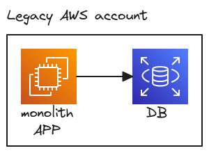
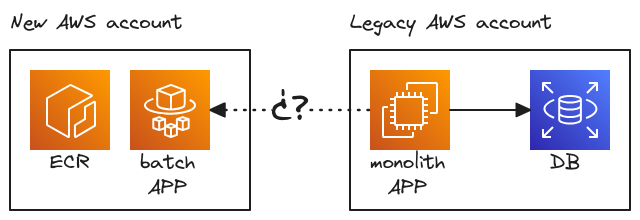
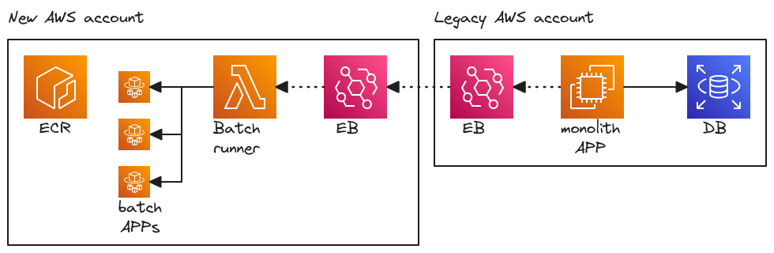
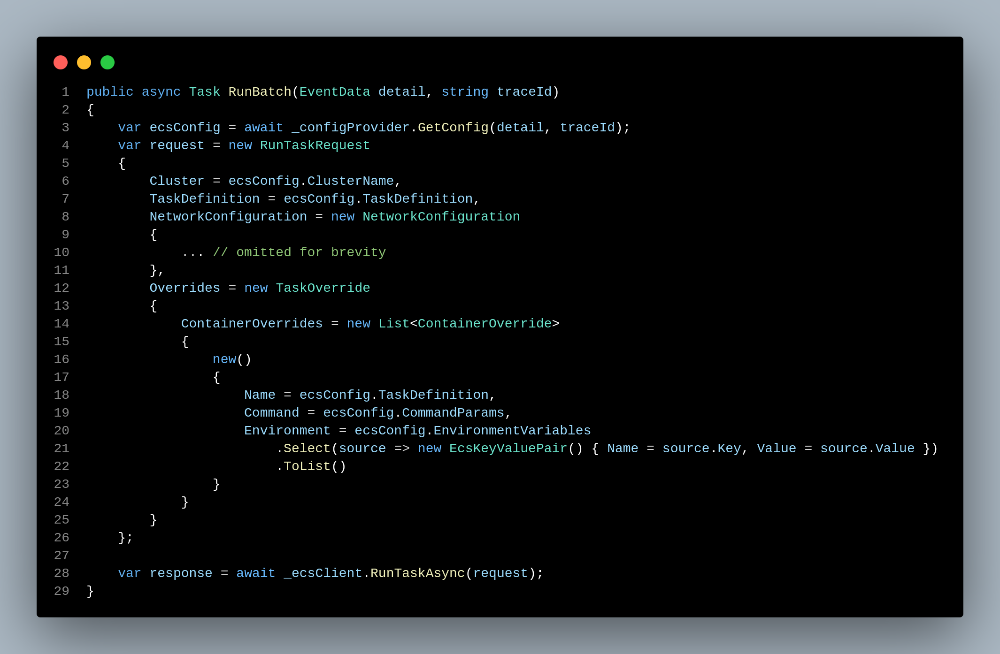
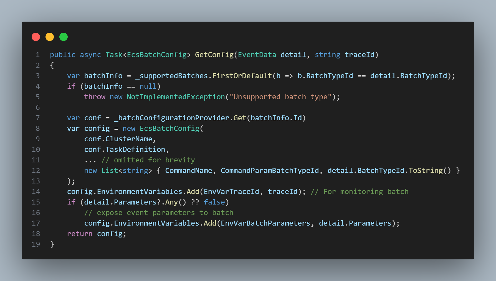
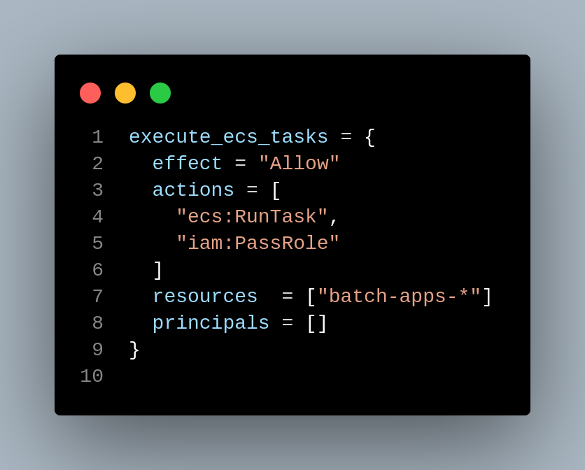
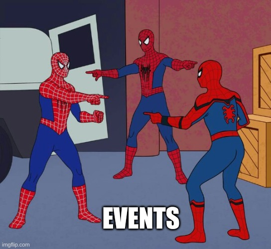
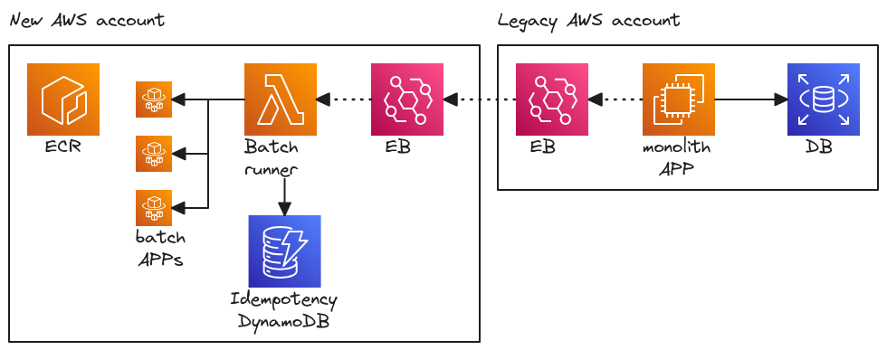
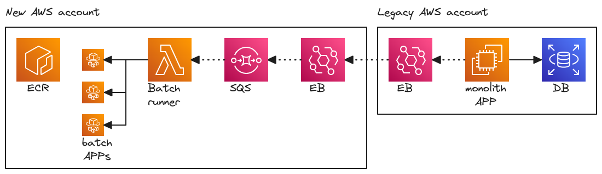
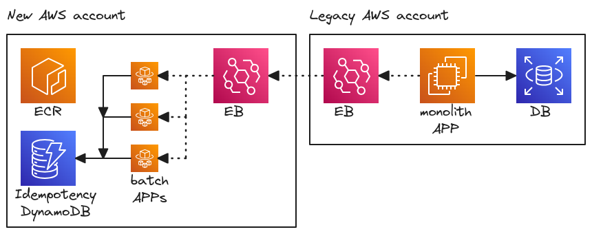

<!--
_class: invert
-->

# **Functionless batch processing with EB**

1. **About me**
2. **Situation**
3. **What we did**
4. **What we learnt**

---

# **About me**

- I am Carlos Angulo
- I work at [Ohpen](https://www.ohpen.com) as a Platform Engineer
- I have more than 8 years of experience
- You can find me on [LinkedIn](www.linkedin.com/in/angulomascarell) or [GitHub](https://github.com/cangulo)

---

# **Situation**

We have a legacy monolith app running in EC2 + RDS

<!-- 
Comment: 
  - We had multiple services that perform batch jobs as daily reports generation
  - Those services are executed once a day in a EC2 instance
-->

---

# **Dockerization**

We dockerized some batch apps in a new account

_How would you trigger those apps from the monolith?🤔_

<!-- 
Comment:
  - We migrated those projects to docker containers and deploy them in a new AWS account
  - The only step left is how to trigger the modernized apps?
    * Trigger the ECS task directly from the EC2 by assuming a role with the permissions required
      - This couples both solutions
    * Make the monolith post a message to a SNS topic which will trigger the lambda
      - This is a better because it decouples but requires cross-account access for the SNS topic
-->

---

# **What we did**

We decide to trigger batches based on events

<!-- 
Comment: 
  - We create the batch runner lambda reusing monolith code
  - lambda triggers different task based on the event type
  - It was the solution with less changes for developers
  - Lambda must be in the same NWK as ECS
-->

---

<!-- 
Comment: 
  - DotNet, so developer friendly
  - Command Parameters and Environment Variables, 
  - ContainerOverrides, we can customize the execution based on the event 
-->

---

<!-- Comment: 
  - Here we get the ECS config for the btach provided in the event
  - Please note
    - We get the batchInfo filter by the BatchTypeId 
    - We provide a TraceId as EV for monitoring
    - We provide the event parameters (parameters for bussiness) as EV
-->

---

<!-- 
Comment: 
  - Permissions: pass role and run task
  - arn with a wildcard to limit the scope to our bath apps
-->

---

# **wait**

What about duplicated events?

<!-- 
Comment: 
  - EB ensures that at least one delivery succeeds but duplicated events can come
  - How would you handled them? Please note this is a idempotency problem, for the same input we want to return 
    * One option is to use a Dynamo DB to store and idempotency key for each execution
-->

---

**Idempotency** with DynamoDB

<!-- store an idempotency key in a DynamoDB -->

<!-- 
Comment: 
  - Each event we receive will be hashed into an idempotency key
      * if the event is not registered, we proceed to execute the ECS task
      * if we receive an event that is already registered in the DB, we ignore it because we don't want to execute it to save costs
-->

---

**Idempotency** with SQS

<!-- 
Comment:
  - No code change needed!☁️
  - We solve this using SQS instead of code + DB. 💸
  - We have a idempotency Windows of 5m which is enough because we have an orchestrator that trigger the batches once per day

Ref: Slide 55
https://d1.awsstatic.com/events/Summits/reinvent2022/API307-R_Designing-event-driven-integrations-using-Amazon-EventBridge.pdf
S3:
https://docs.aws.amazon.com/AWSSimpleQueueService/latest/SQSDeveloperGuide/using-messagededuplicationid-property.html

-->

---

**simpler solution?**

<!-- Comment: 
  - We realize we can skip the lambda and trigger the batches directly
  - We realize we can trigger directly the task with EB
  - We have to give EB the same permissions we gave to the lambda before
-->

---

# **What we learn**

- lambda (+ SQS) offers more control
- EB + ECS is simpler but more expensive and adds logic to batch apps

<!-- 
Comments:
- Lambda + SQS 
  - offers more control because there is a single point to validate input and trigger the batches
  - Single Point of Failure
  - Cheaper because we don't get to execute apps if the input is invalid
- Event Bridge and service integration
  - Simpler, no need of lambda and SQS but need a DynamoDB
  - However, each app must implement idempotency and use the DynamoDB
  - Apps will always be executed making the solution more expensive since Fargate charges you 1 minute per execution.
- Pretty much the same amount of code, just in a different place. 
-->

---

# **Questions?**
